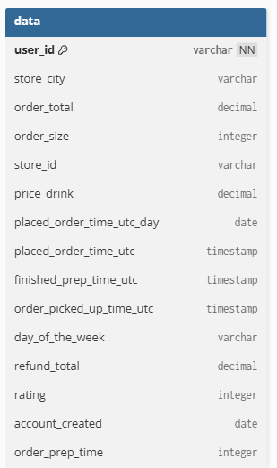
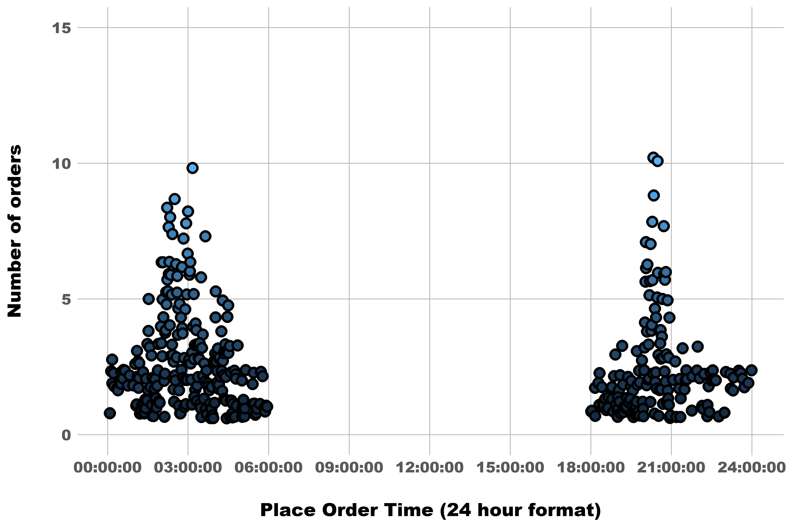
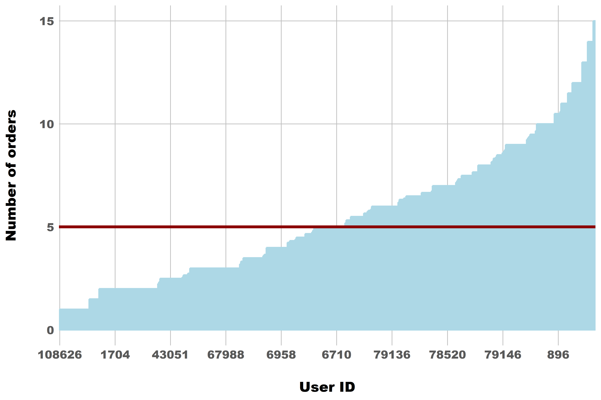

# Li-Chi Boba Shop
Lebintiti Kobe

- [Overview](#overview)
  - [Objective](#objective)
- [Data Structure](#data-structure)
- [Key Recommendations](#key-recommendations)
- [Analysis Approach](#analysis-approach)
  - [Breaking Down The Metric](#breaking-down-the-metric)
- [Recommendations Deep Dive](#recommendations-deep-dive)
  - [Opportunity 1 : Increasing number of
    customers](#opportunity-1--increasing-number-of-customers)
  - [Opportunity 2 : Increasing number of times customers order per
    week](#opportunity-2--increasing-number-of-times-customers-order-per-week)
  - [Opportunity 3 : Increasing number of drinks per
    order](#opportunity-3--increasing-number-of-drinks-per-order)

# Overview

You are the business analyst on the Strategy and Operations team for the
Li-Chi Boba Shop Company. The company has physical boba shops in three
cities in California, and customers place their orders via the app and
pick up the orders in person.

## Objective

The objective of Li-Chi Boba Shop this year is to grow total sales
revenue (please note that menu prices for the year have been set
already). Based on the one week app data attached, please present your
findings and provide a set of recommendations for growing total sales
revenue. Feel free to make your own assumptions.

# Data Structure

***This dataset contains 1,049 customer orders across multiple cities,
capturing sales, refunds, and customer ratings.***

# Key Recommendations

**Increase Customers** : ***Increase marketing/advertising effort in
best performing city and store, while optimize on worst performing store
to drive acquisition and retention.***

- Increase marketing/advertising effort in City A to acquire new users
  given it’s high orders and revenue.

- Drive traffic to store wehqk (best operational excellence) while
  conducting deep-dives in store acjde (worst operational excellence) to
  increase acquisition and retention.

**Increase Order Frequency** : ***Leverage comms capabilities (email,
push notifications) to increase order frequency.***

- Send email/push notifications around two order peak time (2AM-6AM and
  8PM-9PM) to increase order frequency.

**Increase Order Size :** ***Test benefits/promotions to increase
average order size***.

- Incentivize customers (whose order size falls below 5 drinks/order)
  via benefits/promotions to increase the number of boba sold per order.

# Analysis Approach

## Breaking Down The Metric

**Sales Revenue can be broken down into *\# Units Sold x Avg Selling
Price* , so do increase sales revenue we either have to *increase number
of units sold or average selling price* , but prices are already set** .

Therefore to increase Sales Revenue we focus on increasing number of
units sold . Business opportunities that come to mind are ***Increasing
number of customers , Increasing order frequency and Increasing order
size .***

# Recommendations Deep Dive

## Opportunity 1 : Increasing number of customers

### Increase marketing spend in City A (highest demand) , to acquire new customers

| Store City | Total Revenue (\$) | Total Number Of Orders |
|------------|--------------------|------------------------|
| city A     | \$15,864           | 358                    |
| city B     | \$15,827           | 337                    |
| city C     | \$15,854           | 354                    |

***City A has highest total revenue and number of orders (\$15K , 358) ,
followed by City C (\$15K , 354) then City B (\$15K , 354)***

***Given City A has total revenue and number of orders , indicating high
demand , we recommend increasing marketing spend / effort in City A to
acquire new customers build of existing momentum***

### Direct new customers to store “wehqk” (best operational excellence) , to acquire new customers and increase customer retention

| Store ID | Total Refund (\$) | Average Rating | Average Order Prep Time (h:m:s) |
|----------|-------------------|----------------|---------------------------------|
| acjde    | \$401             | 3.16           | 00:09:50                        |
| bjdwe    | \$398             | 3.64           | 00:09:59                        |
| wehqk    | \$394             | 3.74           | 00:09:55                        |

***Store “wehqk” has the lowest refund total , best average rating and
second best average order preparation time (\$394 ,3.74 ,9m 55s)***

***Given that Store “wehqk” has the best operational excellence , we
recommend directing new customers gained via marketing campaigns to this
store as it would leave good impressions on new users , leading to
repeat orders and customer retention***

### Take actions (better staff training e.t.c) in Store “wehqk” (worst operational excellence) to increase customer retention

| Store ID | Total Refund (\$) | Average Rating | Average Order Prep Time (h:m:s) |
|----------|-------------------|----------------|---------------------------------|
| acjde    | \$401             | 3.16           | 00:09:50                        |
| bjdwe    | \$398             | 3.64           | 00:09:59                        |
| wehqk    | \$394             | 3.74           | 00:09:55                        |

***Store “acjde” has the highest refund total , lowest average rating
and best average order preparation time (\$401, 3.16, 9m 50s)***

***Given that Store “wehqk” has the worst operational excellence , we
recommend looking into root causes , taking actions to improve
operational excellence (better staff training , running customer surveys
, e.t.c) , to improve customer retention by improving service
delivery***

## Opportunity 2 : Increasing number of times customers order per week

### Send email / push notifications around 2AM-6AM and 8PM-9PM (popular ordering time) to increase order frequency

***Daily place order times has two sales peaks , one around 2AM-6AM and
the other at around 8PM-9PM .***

***Given that daily sales peak around 2AM-6AM and 8PM-9PM , which
correspond to popular ordering times , we recommend sending email / push
notification reminders to our customers around these time , to increase
order frequency***

## Opportunity 3 : Increasing number of drinks per order

### Offer exclusive promotion / offers to customers with average order size below the average , to increase number of drinks per order

| n   | Percent (%) |
|-----|-------------|
| 230 | 48%         |

***Almost half of our customers (48%) have average order sizes below the
average of 5 drinks per orders***

***Given that almost half of our customers order less than 5 drinks per
order , we recommend offering special promotions (e.g get 10% off when
you order 5 drinks) , to increase number of drinks per order .***
